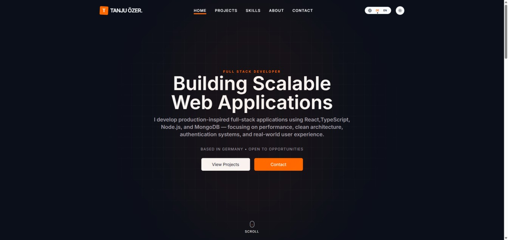
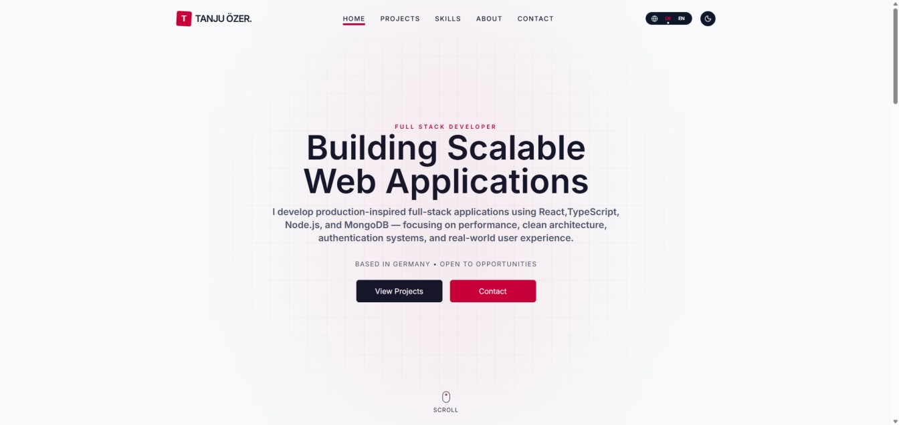
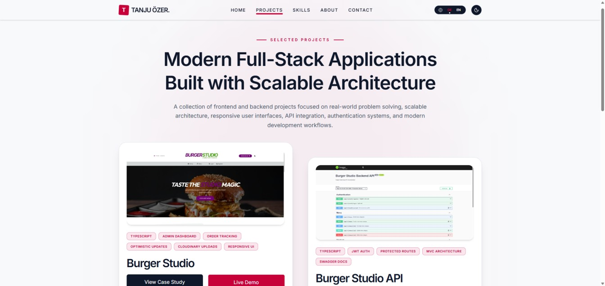
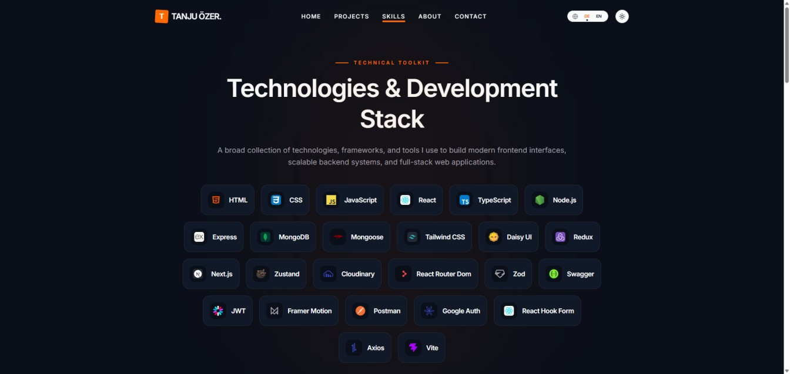
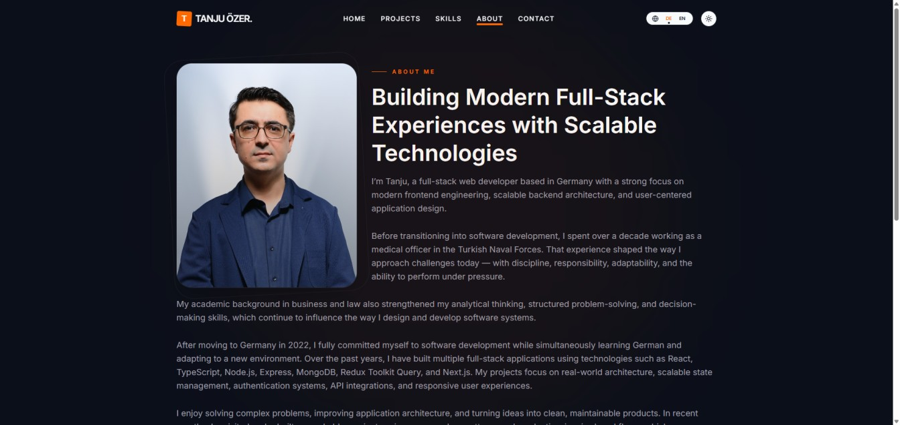
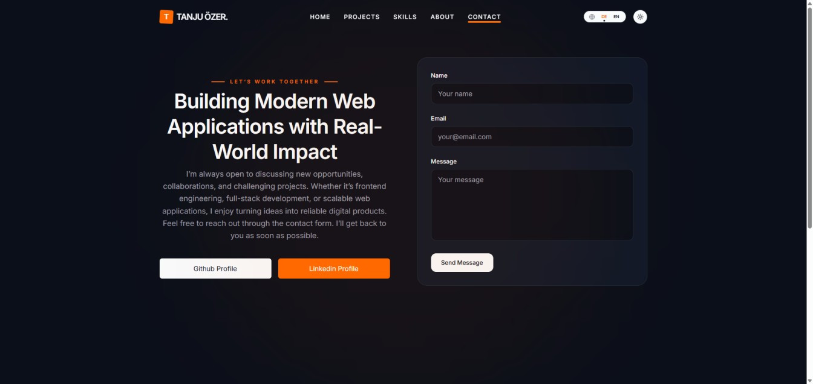
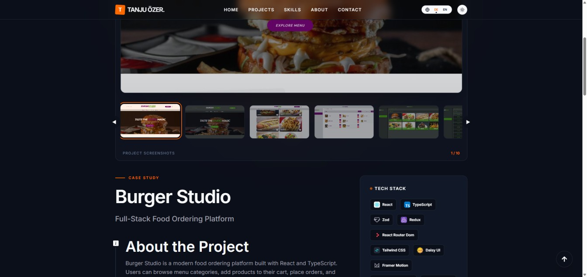

# 🚀 Personal Portfolio

<div align="center">
  
  <br />
  <p>
    <strong>Modern and fully responsive developer portfolio built with React, TypeScript, and Tailwind CSS.</strong>
  </p>
  <a href="https://ozertanju.onrender.com/">🚀 Live Demo</a> •
</div>

---

## 📱 Screenshots

<table width="100%">
  <tr>
    <td width="50%" align="center">
      
      <br /><em>Dark Theme</em>
    </td>
    <td width="50%" align="center">
      
      <br /><em>Projects Page</em>
    </td>
  </tr>
  <tr>
    <td width="50%" align="center">
      
      <br /><em>Skills Page</em>
    </td>
       <td width="50%" align="center">
      
      <br /><em>About Page</em>
    </td>
  </tr>
   <tr>
    <td width="50%" align="center">
      
      <br /><em>Contact Page</em>
    </td>
    <td width="50%" align="center">
      
      <br /><em>Project Detail Page</em>
    </td>
  </tr>
</table>

---

## ✨ Features

- ⚛️ Built with React + TypeScript
- 🎨 Modern UI with Tailwind CSS
- 🌙 Dark theme support
- 🌍 Multi-language support (English / German) using i18next
- 📱 Fully responsive design for all devices
- 🧭 Multi-page navigation with React Router DOM
- ✨ Smooth and interactive user experience
- 🧩 Reusable and scalable component architecture

---

## 🛠 Tech Stack

### 🚀 Core Frameworks & Tools


### 🎨 Styling & Animation


### 🌍 Localization (i18n)


### 🛠️ Development & Quality


---

## 📂 Pages

- Home
- Projects
- Skills
- About
- Contact

---

## 🎯 Goals of the Project

This portfolio was created to showcase:

- Modern frontend development skills
- Responsive UI/UX design
- Scalable React architecture
- Internationalization support
- Clean and maintainable code structure

---

## 📦 Installation

### Clone the repository

```bash
git clone https://github.com/Tanju67/portfolio-new.git
cd portfolio-new
```

### Install dependencies

```bash
npm install
```

### Start development server

```bash
npm run dev
```

---

## 🚀 Build for production

```bash
npm run build
```

---

## 📄 License

This project is licensed under the MIT License.
