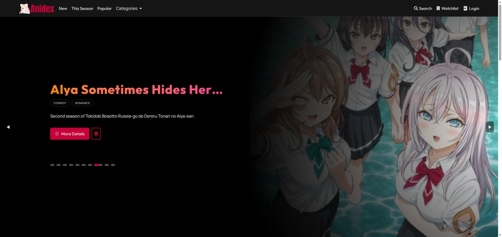
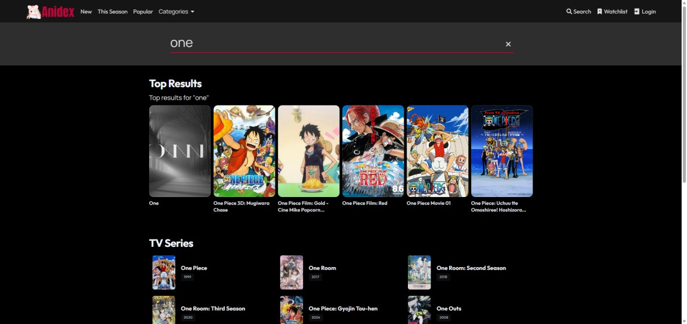
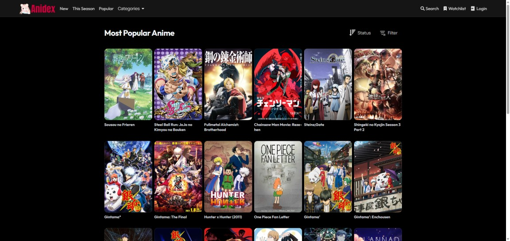
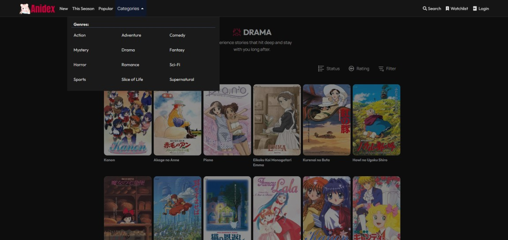

<div align="center">
  
  <br />
  <p>
    <strong>Modern Anime Discovery Platform</strong>
  </p>
  <a href="https://anidex-ozzf.onrender.com">🚀 Live Demo</a> •
  <a href="https://github.com/Tanju67/backend-anidex">📂 Backend Repo</a>
</div>

---

## 📱 Screenshots

<table width="100%">
  <tr>
    <td width="50%" align="center">
      
      <br /><em>Advanced Filtering & Search</em>
    </td>
    <td width="50%" align="center">
      
      <br /><em>Details Page & Trailer</em>
    </td>
  </tr>
  <tr>
    <td width="50%" align="center">
      
      <br /><em>Popular Anime</em>
    </td>
       <td width="50%" align="center">
      
      <br /><em>Different Categories</em>
    </td>
  </tr>
   <tr>
    <td width="50%" align="center">
      
      <br /><em>Different Filter Options</em>
    </td>
    <td width="50%" align="center">
      
      <br /><em>Google and Custom Auth</em>
    </td>
  </tr>
</table>

---

## 📝 Overview

AniDex is a modern anime discovery platform inspired by Crunchyroll. It is built to provide users with real-time anime data in a clean and responsive interface. Users can explore trending, top-rated, and newly released anime, filter content by genres, and search across series and movies.

> [!IMPORTANT]
> This project features a custom-built [REST API](https://github.com/Tanju67/backend-anidex) for the backend, enabling secure user authentication and data persistence.

---

## ✨ Features

- 📈 **Real-time Data:** Trending, top-rated and new anime listings via Jikan API.
- 🔍 **Advanced Discovery:** Genre-based filtering and categorized search.
- 🎥 **Rich Details:** Detailed anime pages with trailers, episodes, and voice actors.
- 🔐 **Secure Auth:** Google Authentication and custom JWT login system.
- 📑 **Persistence:** Personal watchlist with backend synchronization.
- 🚀 **Performance:** Infinite scroll pagination and RTK Query caching.

---

## 🛠 Built With


---

## 🧠 Architecture & Challenges

### Data Strategy

The project uses **Redux Toolkit Query** for data fetching and caching, significantly improving performance and reducing unnecessary API calls. Infinite scroll replaces traditional pagination for a smoother UX.Infinite scroll was implemented to replace traditional pagination, providing a smoother user experience. The application structure is designed to minimize API requests and leverage caching effectively.

### Handling Rate Limits (429 Errors)

One of the biggest challenges was handling **Jikan API rate limits**. To solve this, I implemented:

- **Request Throttling:** Managing request frequency.
- **RTK Query Caching:** Minimizing redundant hits.
- **Graceful Failures:** Implementing retry mechanisms and user-friendly error handling.

---

## 💡 Why This Project Matters

This project demonstrates my ability to:

- Handle real-world API limitations (rate limiting, retries)
- Design scalable data-fetching architecture with RTK Query
- Build performant UIs with infinite scrolling and caching
- Implement secure authentication flows (JWT + Google OAuth)

---

## ⚙️ Getting Started

### 1. Clone repositories

```bash
git clone https://github.com/Tanju67/backend-anidex.git
git clone https://github.com/Tanju67/frontend-anidex.git
```

### 2. Install dependencies

```bash
cd backend-anidex
npm install

cd ../frontend-anidex
npm install
```

### 3. Environment variables

Create `.env` in frontend:

```env
VITE_GOOGLE_CLIENT_ID=your_google_client_id
```

### 4. Run the project

```bash
# backend
cd backend-anidex
npm run dev

# frontend
cd frontend-anidex
npm run dev
```

---

## ⚠️ Notes

- Jikan API has rate limits
- Caching reduces API usage

---

## 📄 License

MIT
